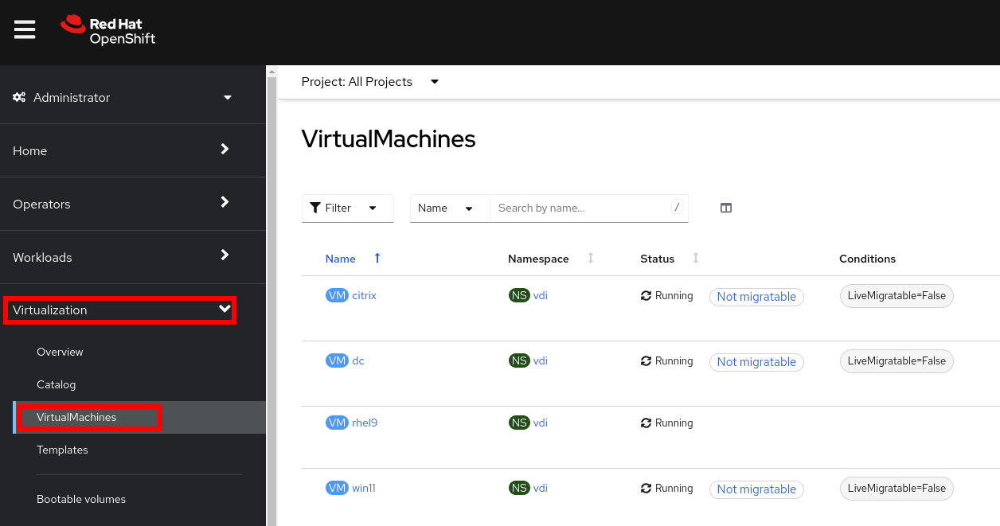
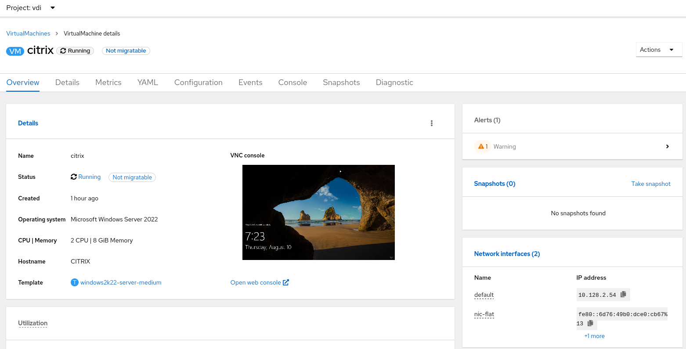
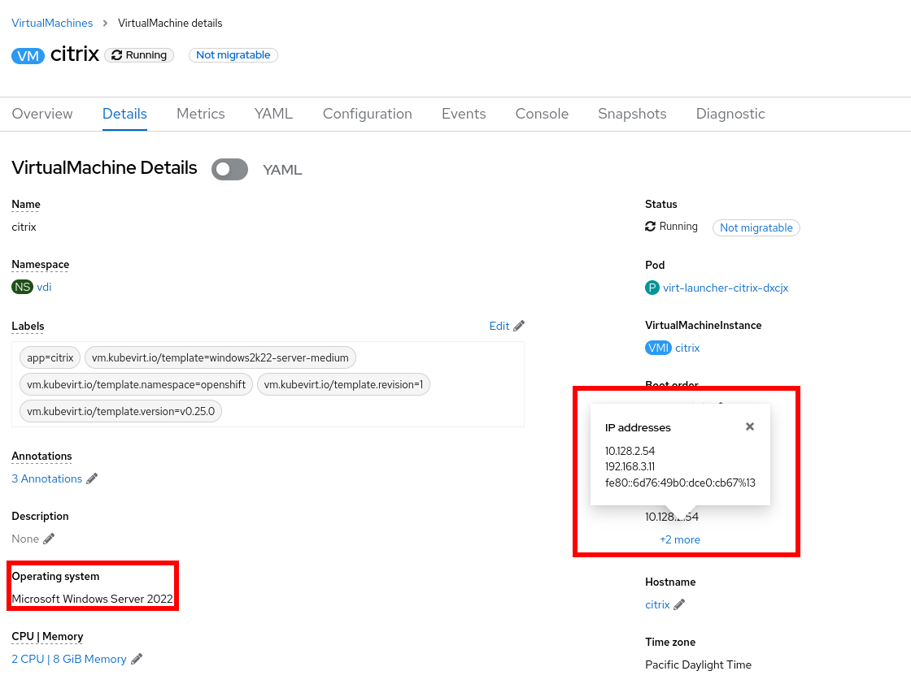
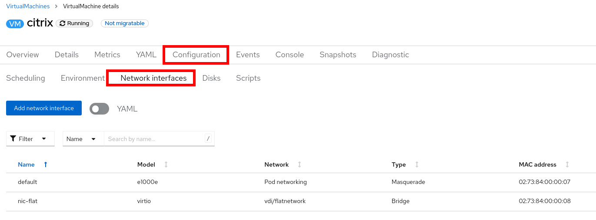
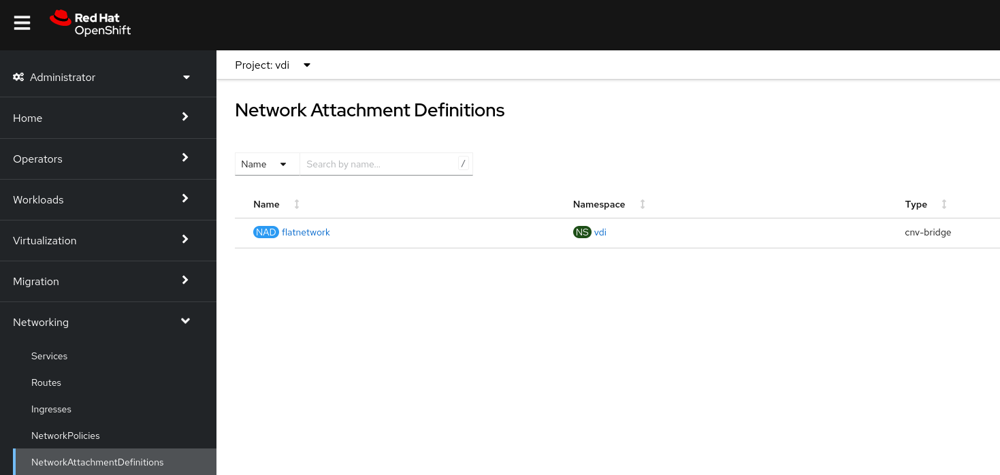
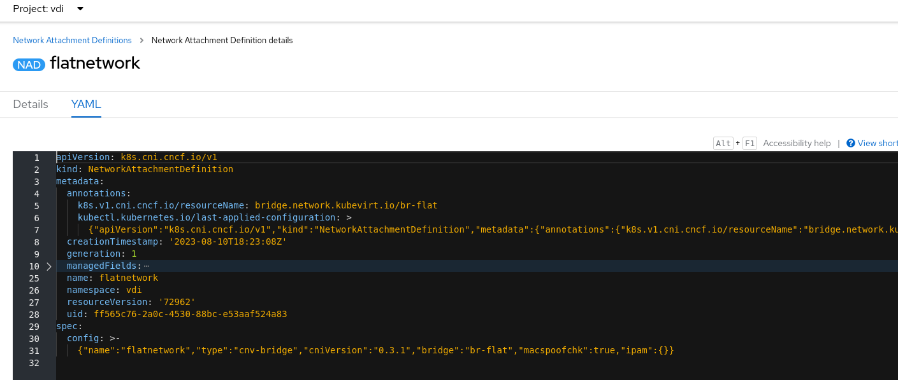
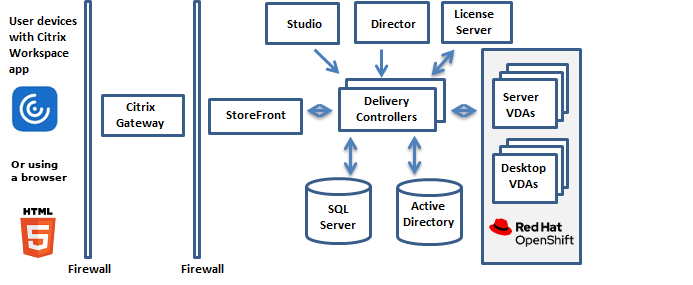

:scrollbar:
:toc2:

= Environment Review 

:numbered:

== Introduction

In this lab, you will review the environment used during this Workshop.

=== Review Virtua Machines

Almost every interaction with Red Hat OpenShift can be done in the OpenShift Console. The console is a full-featured web application that allows administrators and users alike to use the platform in a guided manner. Wizards are provided for most tasks which makes it easy to administer the system.

. Navigate to %ocp_url% and login with user `admin` and the password `%ocp_password%`.

. In the left menu, select *Virtualization* and select *Virtual Machines*
+

+
There are four VMs available:

* *citrix*: A _Windows Server 2022_ with the *Citrix Virtual Apps and Desktops* services running.
* *dc*: A _Windows Server 2022_ configured as _Domain Controller_ and _DNS Server_.
* *rhel*: A _Red Hat Enterprise Linux 9_ used as _Desktop System_.
* *win11*: a _Windows 11_ system used as _Destop System_.

. Press on the *citrix* server to review the information about this _VM_.
+

. Switch to the tab *Details* and press `+2 more` under _IP address_
+

+
The node is connected to two networks:
+
* _Pod network_: Used to be integrated with other OpenShift Services.
* _Flat network_: Connected to a physical network and set a static IP (`192.168.3.11`` for `citrix` node)

. Navigate to tab *Configuration* and subtab *Network Interfaces*
+

The IPs configured in the flat network are the following:

|===
| *Node* | *IP*
| `dc` | 192.168.3.10
| `citrix` | 192.168.3.11
| `rhel9` | 192.168.3.12
| `win11` | 192.168.3.13
|===

The Windows Domain and the DNS configured is `WIN.EXAMPLE.COM`

=== Review Networking

As checked before, the _Virtual Machines_ are attached to a physical network. 

. Navigate to *Networking* -> *NetworkAttachmentDefinition*
+

. Click in `flatnetwork` to obtain information and switch to _YAML_ tab
+

The worker nodes on openShift have configured a Linux bridge named `br-flat`. The configuration was done using the operator *NMState* Operator.

=== Citrix GW

A Citrix Gateway appliance is running in the cluster as independet node. This node is the responsible to provide access from outside of the cluster to the instances running in *OpenShift Virtualization*

== Summary

In this lab, you became familiar with your Red Hat OpenShift Container Platform cluster.