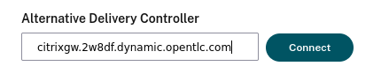

:scrollbar:
:toc2:
:numbered:

= Citrix Virtual Apps and Desktops

In this demo all the components are running in the same Virtual Machine.

== Components

=== Delivery Controller

The Delivery Controller is the central management component of a site. Each site has one or more Delivery Controllers. It is installed on at least one server in the data center. For site reliability and availability, install Controllers on more than one server

=== Database
At least one Microsoft SQL Server database is required for every site to store configuration and session information. This database stores the data collected and managed by the services that make up the Controller. Install the database within your data center, and ensure it has a persistent connection to the Controller.

=== Virtual Delivery Agent (VDA)

The VDA is installed on each physical or virtual machine in your site that you make available to users. Those machines deliver applications or desktops. The VDA enables the machine to register with the Controller, which in turn allows the machine and the resources it is hosting to be made available to users. VDAs establish and manage the connection between the machine and the user device. VDAs also verify that a Citrix license is available for the user or session, and apply policies that are configured for the session.

=== Citrix StoreFront

StoreFront authenticates users and manages stores of desktops and applications that users access. It can host your enterprise application store, which gives users self-service access to the desktops and applications that you make available to them. It also keeps track of users’ application subscriptions, shortcut names, and other data. This helps ensure that users have a consistent experience across multiple devices.

=== Web Studio

Web Studio is a web-based management console that lets you configure and manage your on-premises Citrix Virtual Apps and Desktops deployment. It’s designed for an improved user experience and generally responds faster than Citrix Studio, the Windows-based management console.

=== Citrix Workspace app

Installed on user devices and other endpoints (such as virtual desktops), Citrix Workspace app provides users with quick, secure, self-service access to documents, applications, and desktops. Citrix Workspace app provides on-demand access to Windows, web, and Software as a Service (SaaS) applications. For devices that can’t install the device-specific Citrix Workspace app software, Citrix Workspace app for HTML5 provides a connection through an HTML5-compatible web browser.

== Access to Storefront

. Navigate to %citrixgw_url% and login with user `administrator` and password `%vdi_password%`
+

. After login the *Citrix Workspace* interface will ask how to operate. Select `Use light version`
+

. The environment is not configured to deliver any application or desktop.
+

== Access to Web Studio

. Navigate to %citrixgw_url%/citrix/webstudio in a new tab

. After some seconds it will appear the following screen
+

+
The delivery controller (`citrix.win.example.com`) is not accessible.

. In the `Alternative Delivery Controller` introduce `%citrixgw_host%` and press *Connect*
+

. Login with `Administrator`, password `%vdi_password%` and domain `WIN`
+

. After login the following scren is shown
+

=== Create a Machine Catalog

Machine catalogs are collections of virtual or physical machines that you manage as a single entity. These machines, and the application or virtual desktops on them, are the resources you provide to your users. All the machines in a catalog have the same operating system and the same VDA installed. They also have the same applications or virtual desktops.

. In the left menu click *Machine Catalogs* and click *Create Machine Catalog*
+

. Press *Next* in the `Getting Started with Machine Catalogs` step
. Select `Multi-session OS` and press *Next*
. Press *Next* in the `Machine Management` step
. Press *Add Machines* and type `citrix` and press *Check Names*
+

. Press *Done* and *Next*
. Introduce the name `Citrix Server` as `Machine Catalog Name` and press *Finish*
+

=== Create Delivery Group

. In the left menu click *Delivery Groups* and press *Create Delivery Group*
+

. Press *Next* in the `Getting Started with Delivery Groups` step.
. Select the Machine named `Citrix Server` previously created
. In the `Users` step keep the default `Allow any authenticated users to use this delivery group.`
. In *Applications* press `Add` from `Start Menu` and select `Windows PowerShell`
+

. Click *Ok* and *Next*
. Click *Add* on *Desktops* step. Indicate the `Display Name` as `Citrix Server` and press *OK*.
. Press *Next* and again *Next* on `App Applications`.
. Specify the name *Citrix* as `Delivery Group Name` and press *Finish*
+

=== Try configuration

. Reload the StoreFront portal (previously empty).
+

. Click on *Desktop* and press *Citrix Server*
+

. A new tab will open and after a while the PowerShell console will appear
+

=== DIY

Configure the systems `rhel9` and `win11` in the webstudio. Those machines should be added as *Single-session OS*

== Summary

In this lab, you have configured Citrix Virtual Apps and Desktops and access to the resources.
